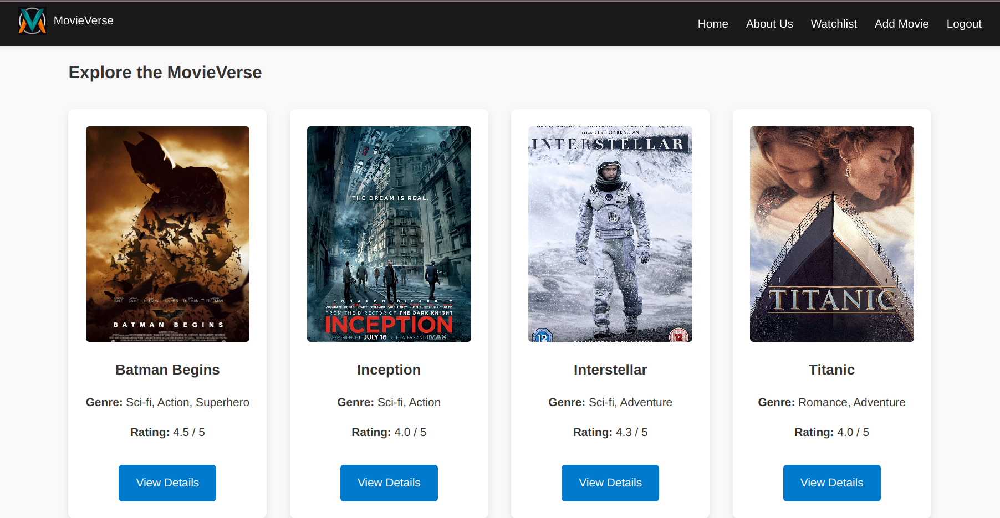
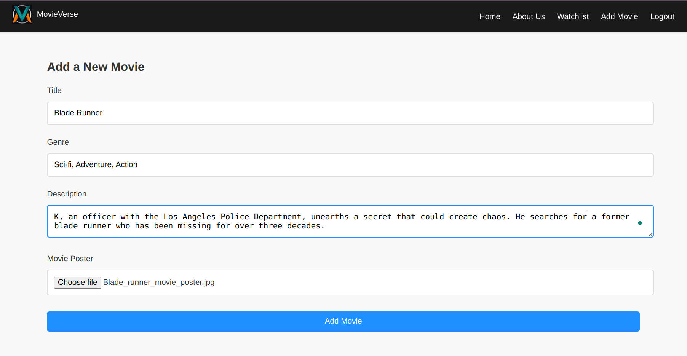
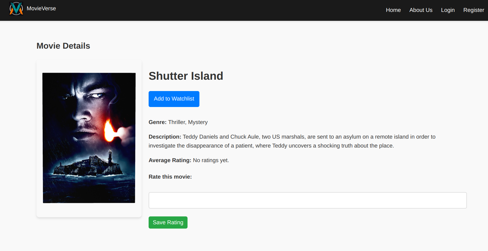
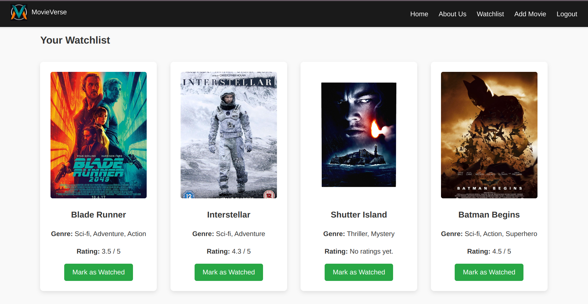
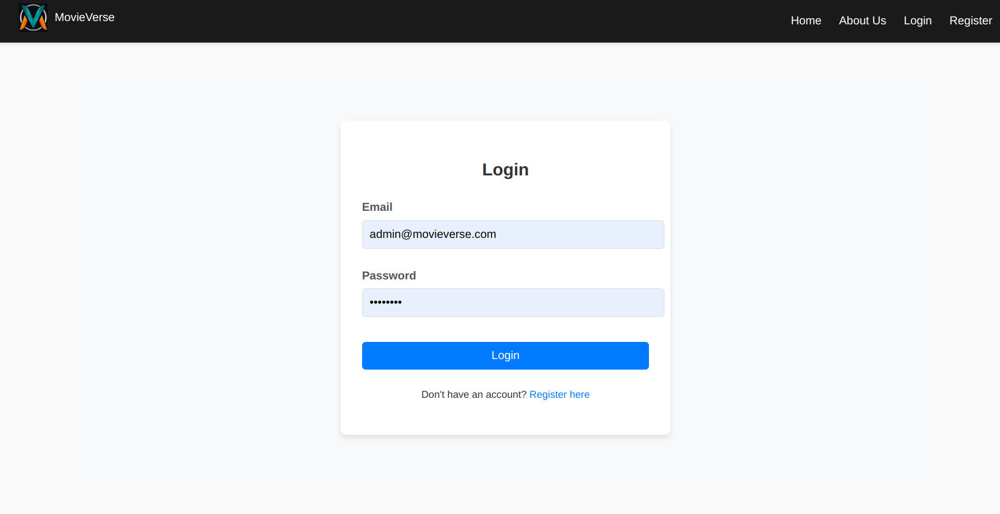
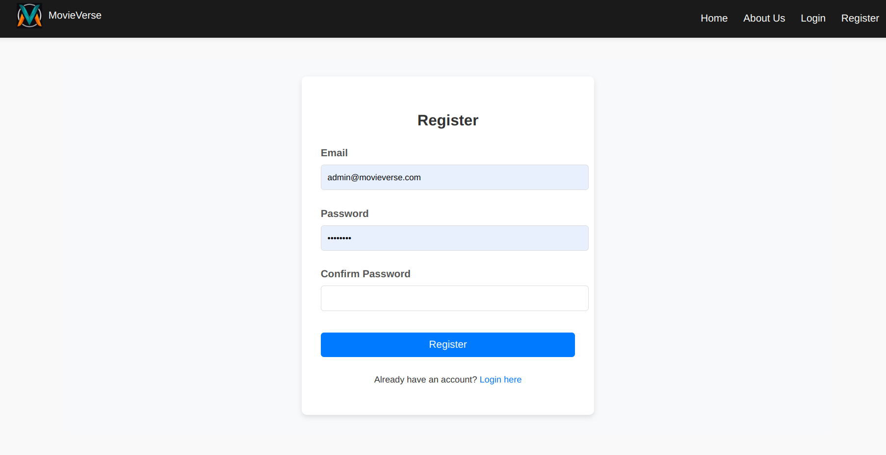

# MovieVerse 🎥

MovieVerse is a Flask-based web application for managing and exploring movies. Users can log in, register, and interact with features such as adding movies, viewing details, and maintaining a watchlist.

---

## Features 🚀

-   User authentication (Login/Register)
-   Add and view movies
-   Detailed movie descriptions
-   Watchlist management
-   About Us page for project details

---

## Tech Stack 💻

-   Frontend: HTML, CSS, Bootstrap
-   Backend: Python (Flask)
-   Database: SQLite
-   Libraries/Packages: Flask-WTF, Jinja2, Werkzeug
-   Environment: Virtual Environment (venv)

---

## Screenshots 📸

### Home Page



### Add Movie (for admin)



### Movie Details



### WatchList



### Login Page



### Register Page



### About us


---

## Installation & Setup 🛠️

1. Clone the repository:

    ```bash
    git clone https://github.com/<your-username>/MovieVerse.git
    cd MovieVerse
    ```

2. Create and activate a virtual environment:

    ```bash
    python3 -m venv .venv
    source .venv/bin/activate
    ```

3. Install dependencies:

    ```bash
    pip install -r requirements.txt
    ```

4. Run the application:

    ```bash
    flask run
    ```

---

## Requirements 📋

-   Python 3.8+
-   Flask 2.0+
-   Flask-WTF
-   SQLite3
-   License 📄

---

## Author ✍️

Developed by Aman Dubey. Feel free to reach out for feedback or collaboration!
